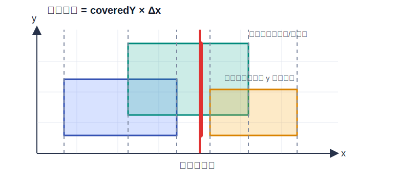
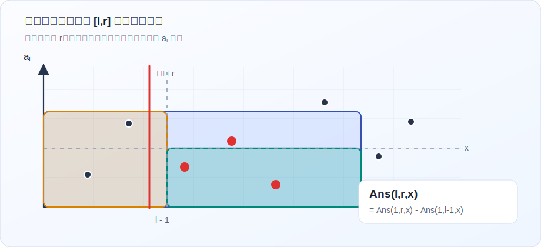

# 扫描线

扫描线，顾名思义是用一根线进行扫描。最简单地，我们可以用以维护矩形面积并的问题。

从更一般的角度看，扫描线经常用于处理 B 维正交范围问题。对于一个多维询问，我们可以把其中一维排序后顺次扫描，剩下的维度交给数据结构维护。

例如矩形面积并中，我们按 $x$ 轴扫描，线段树维护 $y$ 轴上的覆盖长度；离线二维数点中，我们按右端点扫描，权值数据结构维护当前前缀中的数值分布。

## 矩形面积并

???+ note "题目描述"

    求 $n$ 个四边平行于坐标轴的矩形的面积并。

    第一行一个正整数 $n$。

    接下来 $n$ 行每行四个非负整数 $x_1,y_1,x_2,y_2$，表示一个矩形的四个端点坐标为 $(x_1,y_1),(x_1,y_2),(x_2,y_2),(x_2,y_1)$。

??? tip "Hint"

    考虑从左到右运动的一条线。它每次碰到一个新的矩形或者走出一个矩形时，竖直方向的覆盖状态才会发生变化。

??? success "解法"

    考虑从左到右运动的一条线，它会扫过每个矩形。根据这条线每次碰到一个新的矩形或者走出一个矩形的状态，可以将整个矩形的并转化成若干段。那么每段的面积就是竖直方向覆盖过的长度乘上两状态之间的间距。

    也就是说，若当前事件横坐标为 $x_i$，上一个事件横坐标为 $x_{i-1}$，竖直方向覆盖长度为 $len$，则这一段的贡献为：

    $$len(x_i-x_{i-1})$$

    现在考虑如何维护竖直方向的长度。显然能够影响到我们要维护的长度的点就是每个矩形的上下边界。

    每次遇到矩形左边界时，假设矩形在纵向覆盖 $[l,r]$，我们在线段树上对这段区间加一；每次遇到矩形右边界时，对这段区间减一。那么线段树根节点维护的就是当前纵向被覆盖的总长度。

    但是注意到坐标范围可能很大，直接建立权值线段树必然会出问题，所以我们要考虑离散化。对每个出现过的 $y_i$ 离散化后，线段树上的一个叶子不应该对应一个点，而应该对应相邻两个坐标之间的线段长度 $y_i-y_{i-1}$。同样维护即可，实现难度主要在线段树的覆盖次数和覆盖长度。

??? abstract "复杂度分析"

    事件数为 $\mathcal{O}(n)$，排序复杂度为 $\mathcal{O}(n\log n)$。

    每个事件在线段树上做一次区间修改，单次复杂度为 $\mathcal{O}(\log n)$，总时间复杂度为 $\mathcal{O}(n\log n)$，空间复杂度为 $\mathcal{O}(n)$。

## 维护区间询问

???+ note "题目描述"

    给定长度为 $n$ 的序列 $\{a_i\}$，$q$ 个询问，每次询问区间 $[l,r]$ 的 mex。

    mex 是最小排除数，即不在集合内的最小自然数。

??? tip "Hint"

    如果只对 $[1,r]$ 查询，我们可以维护每个权值最后出现的位置。对于 $[l,r]$，只需要找到最后出现位置小于 $l$ 的最小权值。

??? success "解法"

    首先一个直接的思路是，如果只对 $[1,n]$ 查询，我们可以建立一棵权值线段树。对于点 $[i,i]$，保存权值 $i$ 在序列中最后出现的位置。

    注意到若值域超过 $n$，那么它对 mex 一定没有贡献，可以视为没有这个数。那么我们在线段树上找到最小的 $i$，满足 $w_{[i,i]}=0$，答案即为 $i$。

    考虑强化到 $[1,r]$ 的询问，只需要使用可持久化线段树挑出 $r$ 的版本做如上的操作。

    对于 $[l,r]$ 的询问，只需要查询 $w_{[i,i]}<l$ 的最小 $i$ 即可。

    事实上，我们可以借助莫队的思路，将询问排序，让右端点 $r$ 按升序排列。再根据可持久化线段树的想法，为了避免可持久化，依次处理排序后的询问即可。当来到一个新的 $r$ 时，线段树储存的就是对应到可持久化线段树做法中的 $[1,r]$ 版本。

    具体地，当扫描到一个给定的 $r$ 时，先把前一个询问的 $r'$ 到现在这个询问的 $r$ 中间的所有点加进去，即多次单点修改 $\operatorname{Modify}(a_i+1,i)$，让线段树上 $a_i+1$ 位置的点权值变为 $i$。这里要 $a_i+1$，主要是因为 $0$ 也要维护，所以后面的数整体平移一位。

    线段树维护每个权值出现的最右端位置，合并时取 $\min$。对于询问左端点 $l$，只需要在线段树中找到最靠左的权值，其最后出现位置小于 $l$，答案就是对应权值减一。

    观察这几种做法可以发现，莫队算法牺牲了时间复杂度，却简化了数据结构的难度；扫描线做法可以看作莫队思路的一种直接优化，只对一个端点排序，另一侧端点对应的答案用数据结构维护；可持久化线段树则是标准的在线算法。

??? abstract "复杂度分析"

    排序复杂度为 $\mathcal{O}(q\log q)$。

    每个位置只会被加入一次，每次单点修改复杂度为 $\mathcal{O}(\log n)$；每个询问在线段树上二分一次，复杂度为 $\mathcal{O}(\log n)$。

    总时间复杂度为 $\mathcal{O}((n+q)\log n)$，空间复杂度为 $\mathcal{O}(n)$。

## 离线二维数点

???+ note "题目描述"

    给定长度为 $n$ 的序列 $\{a_i\}$，$q$ 次询问，每次询问形如 $(l,r,x)$，即求：

    $$\sum_{i=l}^r[a_i\le x]$$

    其中 $[P]$ 为 Iverson 括号，当条件 $P$ 为真时值为 $1$，否则值为 $0$。

??? tip "Hint"

    考虑能否把询问拆成前缀。若左端点固定为 $1$，扫描右端点时维护权值出现次数即可。

??? success "解法"

    

    把一个询问拆成两个部分。由于询问的信息有可减性，我们可以将 $(l,r,x)$ 转化成 $(1,l-1,x)$ 和 $(1,r,x)$ 两个询问，接着仍然根据扫描线的思路，将询问按右端点升序排列，依次处理。

    仍然维护一棵权值线段树，每个点上维护该权值出现的次数。当我们拓展右端点时，直接单点修改即可。由于拆分后的询问左端点固定为 $1$，所以直接查询当前线段树上 $[1,x]$ 的权值和即可。树状数组同样可以维护。

    事实上，由于这个题与上个题目的相似性，仍然可以用可持久化线段树在线维护，在部分题目中需要用到。

??? abstract "复杂度分析"

    将一个询问拆成两个前缀询问后，询问数为 $\mathcal{O}(q)$。

    每个位置做一次单点修改，每个询问做一次前缀查询，若使用线段树或树状数组维护，时间复杂度为 $\mathcal{O}((n+q)\log n)$，空间复杂度为 $\mathcal{O}(n)$。

## 区间子区间问题

在算法竞赛中，常常能遇到以下形式的问题：

- 给定一个序列，求出其所有子区间的贡献和，即 $\sum f_{l,r}$。
- 给定一个序列，多次询问，每次给定一个区间 $[L,R]$，求该区间内所有子区间的贡献和，即 $\sum_{L\le l\le r\le R}f_{l,r}$。

对于第一种问题，以及第一种问题的特殊情况 $f_{l,r}\in\{0,1\}$，我们可能采取的方案有贡献转化、分治或者数据结构直接维护。

而对于第二类问题，往往单个询问难度低于第一类，但第一类问题的做法难以处理多个询问，于是我们会考虑扫描线的思想，即一个端点扫描过去，另一个端点直接维护。

## HNOI2016 序列

???+ note "题目描述"

    给定长度为 $n$ 的序列 $\{a_i\}$，$q$ 次询问，每次询问 $[l,r]$，求：

    $$\sum_{l\le x\le y\le r}\min_{i\in[x,y]}a_i$$

    即所有子区间最小值之和。

??? tip "Hint"

    可以先考虑如果只有一次询问 $[1,n]$ 该怎么做。

    考虑拓展到 $q$ 个询问后，按右端点排序，并尝试维护当前右端点下所有左端点的信息。

??? success "解法"

    此时化归到上面提到的第一类问题。考虑贡献转化，对于一个 $i$，维护一个二元组 $(L_i,R_i)$，表示区间 $[L_i,R_i]$ 是以 $a_i$ 为最小值的最大区间。该步骤可以由单调栈完成。

    显然所有 $L_i\le l\le i$，$i\le r\le R_i$ 的区间 $[l,r]$ 的最小值均为 $a_i$。这里左侧严格小于，右侧小于等于，用以避免重复。于是 $i$ 号点对 $[1,n]$ 的总贡献为：

    $$a_i(i-L_i+1)(R_i-i+1)$$

    全部加起来就可以得到答案。

    考虑拓展到 $q$ 个询问，自然地，我们可以按右端点 $r$ 排序。如何维护信息才能使得能通过当前 $r$ 的数据结构快速得到 $[l,r]$ 询问的答案？

    重新审视单调栈求 $(L_i,R_i)$ 的过程，我们发现维护的是一个单调递增的栈。每次遇到新的位置 $i$，直接弹出所有大于等于它的栈顶，得到最后栈顶的位置 $p$，则 $L_i=p+1$，把它压入栈即可。

    把要求的内容形式化。记：

    $$X_{l,r}=\min_{i=l}^{r}a_i$$

    $$S_{l,r}=\sum_{i=l}^{r}X_{l,i}$$

    这里 $S_{l,r}$ 表示所有 $[l,i]$ 区间的贡献和，那么询问 $[l,r]$ 的答案即为：

    $$\sum_{i=l}^{r}S_{i,r}$$

    由于我们扫描了 $r$，所以只需要维护目前的所有 $S_{i,r}$。

    首先尝试直接用线段树维护 $S_{i,r}$。当 $r\to r+1$ 时，显然有：

    $$S_{i,r+1}\leftarrow S_{i,r}+X_{i,r+1}$$

    所以我们需要做不同的 $X_{i,r+1}$ 的个数次区间加操作，而不同的 $X_{i,r+1}$ 的个数就是单调栈中元素的个数。当 $\{a_i\}$ 单调递增时，拓展一次右端点的复杂度为 $\mathcal{O}(n\log n)$，显然不可接受。

    考虑维护 $X_{i,r}$。当 $r\to r+1$ 时，记单调栈中 $r+1$ 前面元素的位置为 $p$，有：

    $$X_{i,r+1}=\begin{cases}X_{i,r}&i\le p\\a_{r+1}&i>p\end{cases}$$

    只用做一次区间推平即可。

    又由 $S_{i,r+1}=\sum_{j=i}^{r+1}X_{i,j}$，注意到第 $i$ 个位置曾经存过 $X_{i,i}\sim X_{i,r+1}$ 中的所有值，所以 $S_{i,r+1}$ 就是现在 $i$ 号位置上的值加上该位置的所有历史版本的和。

    接下来要维护的内容就变成了区间推平和区间历史和。若使用历史标记线段树，可以直接维护；也可以使用[双半群模型](double-semigroup.md)中的矩阵方式来描述标记。

??? abstract "复杂度分析"

    每个位置在单调栈中至多进出一次。

    扫描右端点时，每次做一次区间推平和一次历史备份；每个询问在线段树上查询一次。因此总时间复杂度为 $\mathcal{O}((n+q)\log n)$，空间复杂度为 $\mathcal{O}(n)$。

## 结语

扫描线算法是一种经典的离线处理问题的方法，其优势在于可以用较低级的数据结构维护较复杂的信息。

同时，在维护区间子区间相关的问题时，其也展现了独特的优势。
