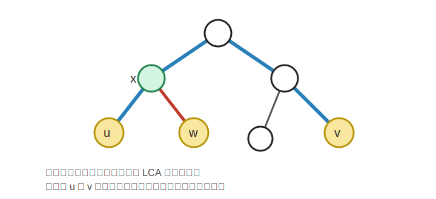

# 相聚

## 题目简述

给定一棵带边权的树。每次询问给出 $k$ 个点，其中 $2\leq k\leq 3$，要求选择一个集合点 $v$，使得这些点到 $v$ 的距离和最小，并输出这个最小值。

题面下载：[九光暑假第一天题面](../../../assets/solution/jiuguang-summer/day1.pdf)

## 第一档部分分

此时 $1\leq n\leq 100$，$1\leq q\leq 100$，且 $k=2$。

对于每个询问，可以直接枚举集合点 $v$。对一个固定的 $v$，分别求出两个给定点到 $v$ 的距离，取所有 $v$ 中的最小值即可。

由于 $n,q$ 都很小，直接用 $\texttt{DFS}$ 求距离也可以通过。时间复杂度为 $\mathcal{O}(qn^2)$。

## 第二档部分分

此时 $1\leq n\leq 100$，$1\leq q\leq 100$，但 $k$ 可以为 $3$。

仍然沿用上一档做法。对于每个询问，枚举集合点 $v$，然后求三个点到 $v$ 的距离和，取最小值即可。

时间复杂度仍然为 $\mathcal{O}(qn^2)$。

## 第三档部分分

此时 $n,q$ 较大，但 $k=2$。

我们知道在树上，两点之间的简单路径有且仅有一条。假设询问给出的两个点为 $u,v$，那么路径：

$$
u\to \mathbf{LCA}(u,v)\to v
$$

就是它们之间的唯一简单路径。选择这条路径上的任意一点作为集合点，到两个点的距离和都等于 $\operatorname{dis}(u,v)$，并且显然不可能更小。

因此当 $k=2$ 时，答案就是：

$$
\operatorname{dis}(u,v)
$$

可以预处理倍增求 $\mathbf{LCA}$，用：

$$
\operatorname{dis}(u,v)=d_u+d_v-2d_{\mathbf{LCA}(u,v)}
$$

计算距离。时间复杂度为 $\mathcal{O}((n+q)\log n)$。

## 正解

此时 $n,q$ 都很大，且 $k$ 可以为 $3$。

根据前一档部分分的启发，设三个点为 $u,v,w$。我们先看 $u$ 到 $v$ 的路径。

若 $w$ 在这条链上，那么选 $w$ 作为集合点一定是最优的；若 $w$ 不在这条链上，那么三条路径的交汇点一定会出现在：

$$
\mathbf{LCA}(u,v),\quad \mathbf{LCA}(u,w),\quad \mathbf{LCA}(v,w)
$$

之中。

因此我们只需要枚举这三个候选点作为集合点，计算：

$$
\operatorname{dis}(u,x)+\operatorname{dis}(v,x)+\operatorname{dis}(w,x)
$$

的最小值即可。对于 $k=2$ 的询问，直接按上一档处理即可。

## 性质观察

仔细研究正解的分类讨论可以知道，最优集合点只会是两两 $\mathbf{LCA}$ 中的一个。事实上，在三个点的情况下，$\mathbf{LCA}(u,v)$、$\mathbf{LCA}(u,w)$、$\mathbf{LCA}(v,w)$ 中一定有一个就是三点路径的交汇点。

预处理倍增数组和根到每个点的距离后，每次询问只需要常数次 $\mathbf{LCA}$。时间复杂度为 $\mathcal{O}((n+q)\log n)$，空间复杂度为 $\mathcal{O}(n\log n)$。
