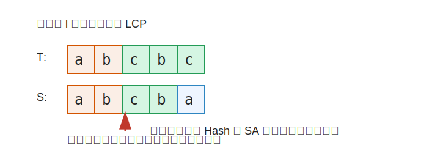

# 流光之歌

## 题目简述

给定歌魔声音 $T$，以及 $n$ 个成员声音 $S_i$。每次询问给出一个不可用前缀长度 $l$，比较时需要忽略每段声音的前 $l$ 个字符，要求找出与歌魔声音最长公共前缀最大的成员编号，若有多个则输出编号最小者。

题面下载：[九光暑假第一天题面](../../../assets/solution/jiuguang-summer/day1.pdf)

## 第一档部分分

首先可以设计一个简单暴力。

对于每个询问，直接把 $T$ 和每个 $S_i$ 的前 $l$ 个字符忽略，然后逐字符比较最长公共前缀。得到所有 $S_i$ 的相似程度后，取最大值，若相同则取编号最小的一个。

时间复杂度为：

$$
\mathcal{O}\left(q\times \left(\sum |S|+|T|\right)\right)
$$

可以通过较小的数据。

## 第二档部分分

考虑 $n=2$ 的情况。这个时候本质上只需要比较很少的字符串，但如果每次仍然逐字符比较，在长字符串上仍然会慢。

一般遇到字符串匹配问题，我们可以考虑 $\texttt{Hash}$。最长公共前缀具有单调性：若长度为 $x$ 的前缀相同，则所有更短的前缀也相同；若长度为 $x$ 的前缀不同，则所有更长的前缀也不同。

于是对于每一对字符串，我们可以二分最长公共前缀长度，并用字符串哈希在 $\mathcal{O}(1)$ 时间内判断某个长度是否相同。

整体时间复杂度为：

$$
\mathcal{O}\left(\sum |S|+|T|+q\log \min(|S|,|T|)\right)
$$

这里的思想可以直接推广到正解。

## 正解一

本题中 $n$ 很小，最大只有 $10$，而总字符串长度和询问数较大。

我们可以预处理 $T$ 和所有 $S_i$ 的哈希。对于每个询问 $l$，枚举每一个 $S_i$，用二分加哈希求出忽略前 $l$ 个字符后的最长公共前缀长度。

设当前成员的匹配长度为 $Len_i$。我们取 $Len_i$ 最大的成员；如果有多个成员匹配长度相同，就取编号最小的成员。

由于每次询问只枚举 $n$ 个字符串，而 $n\leq 10$，所以可以通过所有数据。

时间复杂度为：

$$
\mathcal{O}\left(\sum |S|+|T|+qn\log \min(|S_i|,|T|)\right)
$$

## 正解二

也可以使用后缀数组完成本题。

首先把所有字符串拼接成一个长字符串，并在不同字符串之间加入互不相同或不会出现在原串中的分隔符。对这个长字符串求后缀数组和高度数组，再用 $\texttt{ST}$ 表维护区间高度数组最小值。

对于两个后缀，它们的最长公共前缀可以转化为后缀数组排名区间上的高度数组最小值。于是每次询问时，歌魔声音去掉前 $l$ 个字符后对应一个后缀，每个成员声音去掉前 $l$ 个字符后也对应一个后缀，二者的 $\texttt{LCP}$ 可以用一次区间最小值查询得到。

这样每次询问仍然枚举成员并取最大相似程度，时间复杂度为：

$$
\mathcal{O}\left((\sum |S|+|T|)\log(\sum |S|+|T|)+qn\right)
$$

实现上哈希做法更短，后缀数组做法更稳定，两种做法都可以通过本题。
